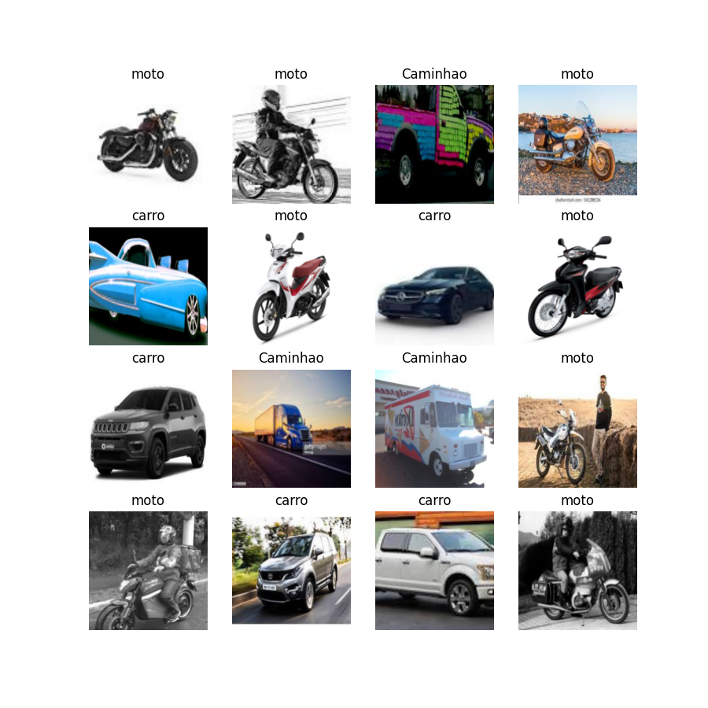
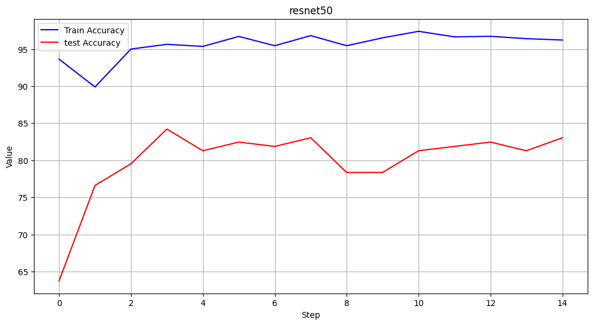
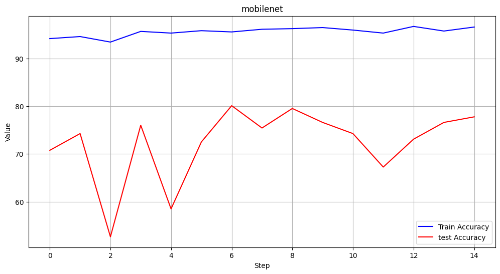
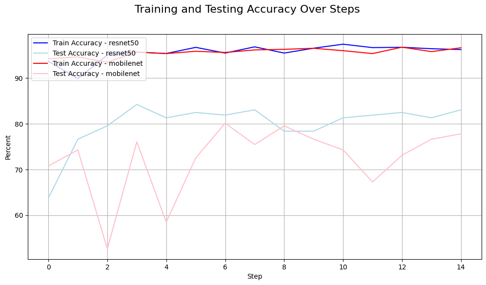
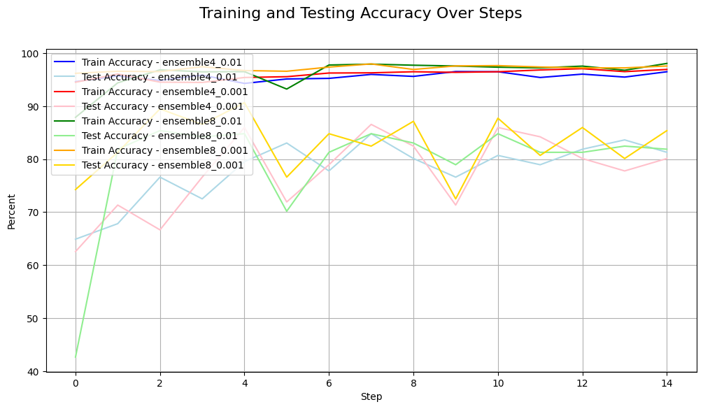
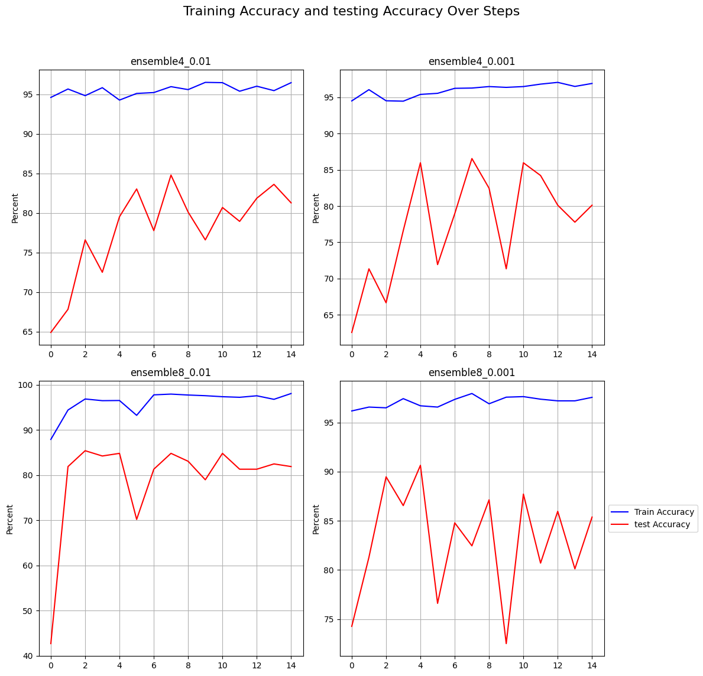
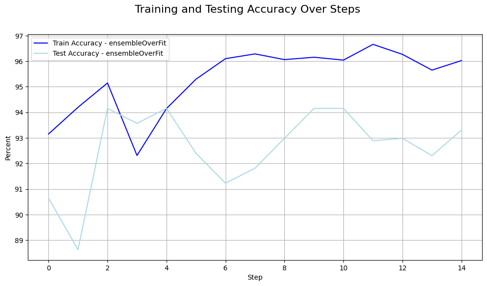
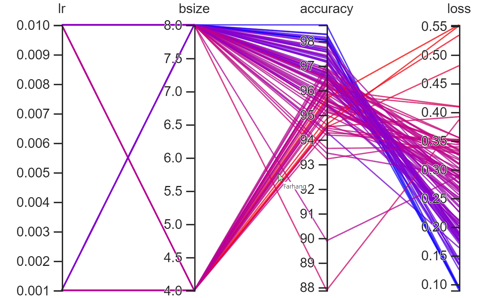

#  Image Classification with Pytorch

This project aims to classify images from the car, truck, and motor dataset obtained from Kaggle and Roboflow. The images are categorized based on vehicle types, including cars, trucks, and motorcycles, using deep learning techniques implemented in PyTorch. The dataset utilized in this project was acquired directly from Kaggle and Roboflow and was initially curated for vehicle classification tasks. We extend our appreciation to both Kaggle and Roboflow for making this dataset available for our research.

## Table of Contents


- [Image Classification with Pytorch](#image-classification-with-pytorch)
  - [Table of Contents](#table-of-contents)
  - [Overview](#overview)
  - [Dataset](#dataset)
  - [Training Process](#training-process)
    - [Transfer learning](#transfer-learning)
      - [Transfer learning with ResNet](#transfer-learning-with-resnet)
      - [Transfer learning with MobileNet](#transfer-learning-with-mobilenet)
    - [Ensemble Learning:](#ensemble-learning)
      - [Prevent Overfitting in Ensemble Model](#prevent-overfitting-in-ensemble-model)
      - [Loss](#loss)

## Overview
In this project, we looked into using two special models, ResNet-50 and MobileNet V2, to classify images. Our job was to figure out if the pictures showed car,motor and truck.

For the first model, ResNet-50, it's like a really good starting point. It already knows a lot about images, so we just had to teach it a bit more about our specific pictures.

The second model, MobileNet V2, is like a super efficient version. It's good at understanding images even if we don't have a lot of computing power.

We didn't stop there. We also tried something cool called ensemble learning. This means we let both ResNet-50 and MobileNet V2 work together to make decisions. It's like having two experts giving their opinions, and we listen to both because they see things differently.

So, we played with these models, made them smarter for our job, and even let them work together for better results.

## Dataset
write test about dataset thet about project aims to classify images from the car, truck, and motor dataset obtained from Kaggle and Roboflow 




## Training Process


### Transfer learning
In the initial phase of our training process, we harnessed the power of transfer learning. This technique involves leveraging knowledge from pre-trained models and adapting it to our specific task. By utilizing the foundation of existing models that are well-versed in image recognition, we significantly expedited the training process and enhanced the accuracy of our own models. Transfer learning essentially enables us to build upon the expertise accumulated by these models, refined through extensive exposure to diverse images.

In essence, transfer learning empowers us to tap into the domain knowledge acquired by existing models, effectively "transferring" their expertise to our project. This not only accelerates our training process but also heightens the precision of our models in classifying scenes. Their accuracy is boosted by the distinct features they've assimilated from a wide range of images across the domain.

We train this dataset with two models, ` ResNet-50` and `MobileNet V2 `:

#### Transfer learning with ResNet
- ResNet-50: ResNet-50 is a deep convolutional neural network architecture known for its exceptional ability to capture intricate features in images. It employs skip connections, allowing for the efficient training of deep networks without succumbing to vanishing gradient problems. We adapted this architecture to our task, enhancing its pre-learned knowledge to excel in our scene classification.

```bash
class modelResnet(nn.Module):
    def __init__(self , in_channels=3, num_class=6):
        super(modelResnet , self).__init__() 
        self.resnet = models.resnet50(pretrained = True)
        for param in self.resnet.parameters():
            param.requires_grad = False
        num_featu = self.resnet.fc.in_features
        self.resnet.fc = nn.Linear(num_featu,num_class)
    

    
    def forward(self,x):
        return self.resnet(x)
```
We have a train accuracy and test accuracy plot for the Resnet model plot below :


#### Transfer learning with MobileNet

- MobileNet V2: MobileNet V2 stands out for its lightweight design and efficiency, making it suitable for resource-constrained environments. Its depthwise separable convolutions significantly reduce computational demands while preserving accuracy. By repurposing MobileNet V2, we tapped into its streamlined structure for accurate image classification without compromising performance.

```bash

class modelMobilenet(nn.Module):
    def __init__(self , in_channels=3, num_class=6):
        super(modelMobilenet , self).__init__() 
        self.mobilenet = models.mobilenet_v2(pretrained = True)
        for param in self.mobilenet.parameters():
            param.requires_grad = False
        self.mobilenet.classifier[-1] = nn.Linear(self.mobilenet.classifier[-1].in_features, num_class)
        
    
    def forward(self,x):
        return self.mobilenet(x)
```

We have a train accuracy and test accuracy plot for the mobilenet model  below :


####Comparison
ResNet-50 and MobileNet V2 are two distinct yet impactful convolutional neural network architectures for image classification. ResNet-50 is renowned for its deep structure and skip connections, which facilitate the training of very deep networks while mitigating vanishing gradient problems. This architecture excels in capturing intricate features but demands more computational resources. On the other hand, MobileNet V2 prioritizes efficiency with its lightweight design and depthwise separable convolutions, making it suitable for resource-constrained environments without sacrificing performance. While it may not capture features as intricately as ResNet-50, MobileNet V2's streamlined structure is adept at extracting essential information from images while using fewer parameters. The choice between ResNet-50 and MobileNet V2 hinges on the balance between accuracy and efficiency, with ResNet-50 excelling in complexity and feature representation, while MobileNet V2 shines in scenarios where computational resources are limited.


### Ensemble Learning:

In the second part of our training process, we ventured into ensemble learning. This innovative technique involves combining multiple models to generate predictions, often leading to improved overall performance. The synergy of different models enhances their collective intelligence, enabling them to handle varying decision boundaries and nuances in the data.

Through ensemble learning, we unified the strengths of both `ResNet-50` and `MobileNet V2`, creating a dynamic partnership that increased our models' predictive capabilities. This collaborative approach allows us to capture diverse viewpoints and enhance our ability to accurately classify scenes within the dataset.


```bash
class MyEnsemble(nn.Module):
    def __init__(self , modelA , modelB , num_Class = 6):
        super(MyEnsemble,self).__init__()
        self.modelA = modelA
        self.modelB = modelB

        self.fc1 = nn.Linear(num_Class*2 , num_Class)

    def forward(self, x):
        out1 = self.modelA(x)
        out2 = self.modelB(x)

        out = torch.cat((out1 , out2),dim=1)

        x = self.fc1(out)
        return x
```
We conducted training on this dataset using two different batch sizes, namely 4 and 8, along with learning rates of 0.01 and 0.001. Our training approach incorporated an ensemble model that combined the strengths of both ResNet and MobileNet architectures. By using this combined model, we aimed to capitalize on the unique capabilities of each architecture, enhancing our system's ability to accurately classify the vehicles in the dataset. This combination of batch sizes, learning rates, and ensemble learning contributes to our goal of achieving optimal performance in vehicle classification.





###Overfit
Additionally, we've observed a significant gap between the training accuracy and the test accuracy in these four models.

This divergence suggests the presence of overfitting, where the models excel at memorizing the training data but struggle to generalize to new data. This emphasizes the need to find ways to bridge this gap for more reliable and accurate model performance in real-world situations.




#### Prevent Overfitting in Ensemble Model

Initially, we introduced an ensemble model denoted as "MyEnsemble," comprising two base models, modelA and modelB, with the aim of creating a synergistic classification system. However, this initial ensemble experienced overfitting issues. To address this, we evolved our approach and crafted the "EnsembleModel_overfit." This refined ensemble design capitalizes on the prowess of both ResNet and MobileNet models to combat overfitting. By strategically incorporating layer normalization, dropout, and finely tuned fully connected layers, we cultivate a model that effectively prevents overfitting while maintaining robust predictive capabilities. This evolution underscores the dynamic nature of refining ensemble architectures to tackle challenges head-on, ultimately delivering more dependable and accurate predictions.

```bash
class ResNetModel(nn.Module):
    def __init__(self):
        super(ResNetModel, self).__init__()
        self.resnet = models.resnet50(weights='ResNet50_Weights.DEFAULT')
                
        for param in self.resnet.parameters():
            param.requires_grad = False
        self.resnet.fc = nn.Linear(self.resnet.fc.in_features, 1024)

    def forward(self, x):
        return self.resnet(x)

class MobileNetModel(nn.Module):
    def __init__(self):
        super(MobileNetModel, self).__init__()
        self.mobilenet = models.mobilenet_v2(weights='MobileNet_V2_Weights.DEFAULT')
                
        for param in self.mobilenet.parameters():
            param.requires_grad = False
        self.mobilenet.classifier[1] = nn.Linear(self.mobilenet.classifier[1].in_features, 1024)

    def forward(self, x):
        return self.mobilenet(x)


class EnsembleModel_overfit(nn.Module):
    def __init__(self, resnet_model, mobilenet_model, num_classes=3):
        super(EnsembleModel_overfit, self).__init__()
        self.resnet_model = resnet_model
        self.mobilenet_model = mobilenet_model
        self.fc =  nn.Sequential(
                                    nn.LayerNorm(2048),  
                                    nn.Dropout(0.5),    
                                    
                                    nn.Linear(2048, 1024), 
                                    nn.ReLU(inplace=True),
                                    nn.LayerNorm(1024),
                                    nn.Dropout(0.5),
                                    
                                    nn.Linear(1024, 512),        
                                    nn.ReLU(inplace=True),
                                    nn.LayerNorm(512),
                                    nn.Dropout(0.5),
                                    
                                    nn.Linear(512, num_classes )

    def forward(self, x):
        resnet_features = self.resnet_model(x)
        mobilenet_features = self.mobilenet_model(x)
        features = torch.cat((resnet_features, mobilenet_features), dim=1)
        output = self.fc(features)
        return output

```
As evident from the diagram below, the utilization of model assembly effectively mitigates overfitting, resulting in train accuracy values that closely align with test accuracy .


#### Loss
During our analysis, a notable trend emerged regarding the relationship between loss values, learning rates, and batch sizes. Specifically, we noticed that the maximum loss occurred when utilizing a learning rate of 0.01 in conjunction with a batch size of 4. Conversely, the minimum loss was achieved when employing a learning rate of 0.001 while utilizing a batch size of 8.

This observation underscores the intricate interplay between these key factors in our training process. It highlights the importance of careful parameter selection to achieve optimal results. By pinpointing the combinations that lead to both the highest and lowest loss values, we gain valuable insights into how these choices impact the performance of our models.


